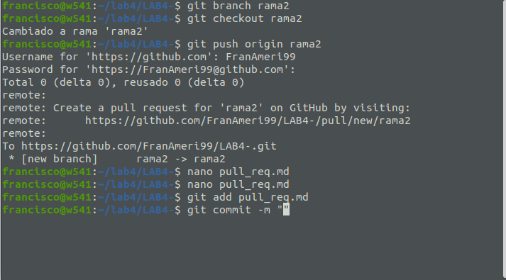
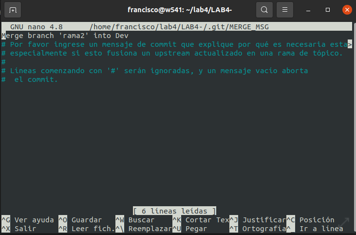
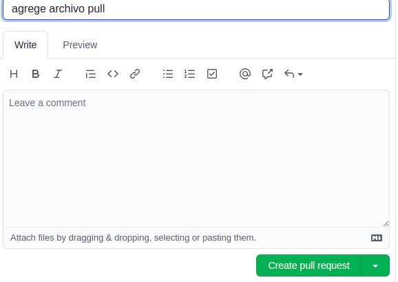
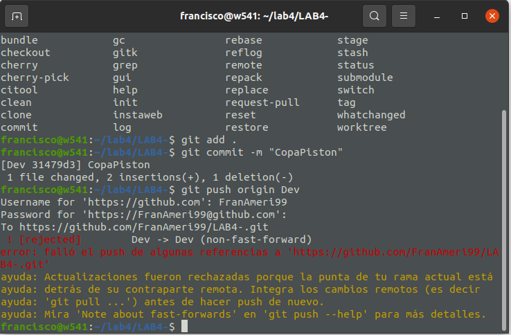
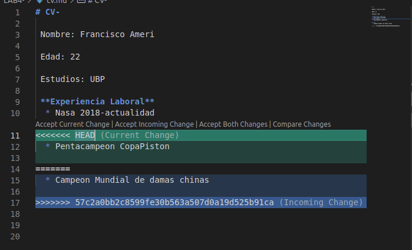

# UBP-LAB4
- Link Del Repo [this](https://github.com/FranAmeri99/LAB4-)

4- Familiarizarse con el concepto de Pull Request

* Crear un branch local y agregar cambios a dicho branch.
* El cambio debe ser un archivo md donde se explique que es un pull request y un link a éste en el readme.
* Subir el cambio a dicho branch y crear un pull request.
 

* Completar el proceso de revisión en github y mergear el PR al branch master.
 
 

5- Mergear código con conflictos
* En el clon inicial, modificar el CV.md cambiando algunas lineas.
* Hacer commit y subir el cambio a master a github.
* En el segundo clon también realizar cambios en las mismas líneas que se modificaron en el otro directorio.
* Intentar subir el cambio, haciendo un commit y push. Mostrar el error que se obtiene.
* Hacer pull y mergear el código (solo texto por ahora), mostrar la herramienta de mergeo como luce.
* Resolver los conflictos del código.

 
 
